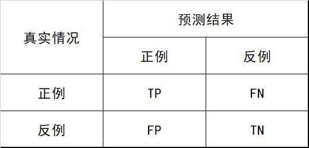

##### 混淆矩阵
    

##### 准确率、召回率、F值
    准确率(Precision)：TP / (TP + FP) ， 预测的正例中有多少是真的正例。
    召回率(Recall)：TP / (TP + FN) ， 真正例中有多少正例被预测出来。
    F值(F-Measure)： F = 准确率 * 召回率 * 2 / (准确率 + 召回率)
    
##### ROC与AUC
    真正例率：TPR =  TP / (TP + FN)
    假正例率：FPR = FP / (FP + TN)

    ROC曲线：
    
    AUC计算：
    
