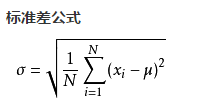
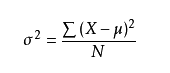
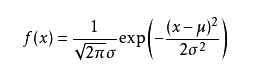
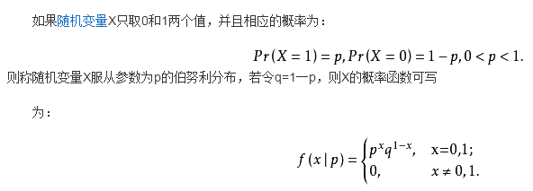
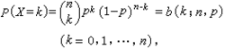
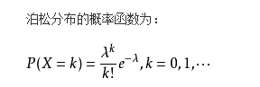
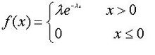
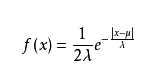

##### 1.标准差
    标准差（Standard Deviation），用σ表示，标准差是方差的算术平方根。
    标准差能反映一个数据集的离散程度。平均数相同的两组数据，标准差未必相同。
      
    公式中数值X1，X2，X3，......XN(皆为实数)，其平均值(算术平均值)为μ，标准差为σ。
    
##### 2.方差
    方差是在概率论和统计方差衡量随机变量或一组数据时离散程度的度量。
    
     为总体方差，为变量，为总体均值，为总体例数。

##### 3.正态分布(高斯分布)
    若随机变量X服从一个数学期望为μ、方差为σ^2的正态分布，记为N(μ，σ^2)。
    其概率密度函数为正态分布的期望值μ决定了其位置，其标准差σ决定了分布的幅度。
    当μ = 0,σ = 1时的正态分布是标准正态分布。
    
    均值为μ,方差为σ2 。

##### 4.伯努利分布
    伯努利分布亦称“零一分布”、“两点分布”。
    随机变量X有伯努利分布, 参数为p(0<p<1),如果它分别以概率p和1-p取1和0为值。EX= p,DX=p(1-p)。
    伯努利分布是一个离散型机率分布，是N=1时二项分布的特殊情况。 

    
##### 5.二项分布
    二项分布就是重复n次独立的伯努利试验。
    在每次试验中只有两种可能的结果，而且两种结果发生与否互相对立，并且相互独立，与其它各次试验结果无关。
    事件发生与否的概率在每一次独立试验中都保持不变，则这一系列试验总称为n重伯努利实验。
    当试验次数为1时，二项分布服从0-1分布。

##### 6.多项分布
    多项式分布（Multinomial Distribution）是二项式分布的推广。
    二项分布的典型例子是扔硬币，硬币正面朝上概率为p, 重复扔n次硬币，k次为正面的概率即为一个二项分布概率。
    把二项分布公式推广至多种状态，就得到了多项分布。
    
##### 7.Beta分布
    贝塔分布，也称Β分布，是指一组定义在(0,1) 区间的连续概率分布。
    贝塔分布（Beta Distribution) 是一个作为伯努利分布和二项式分布的共轭先验分布的密度函数。

##### 8.泊松分布
    如果某事件以固定强度λ，随机且独立地出现，该事件在单位时间内出现的次数（个数）可以看成是服从泊松分布。
  
    泊松分布的期望和方差均为λ。
    泊松分布的参数λ是单位时间(或单位面积)内随机事件的平均发生次数。 泊松分布适合于描述单位时间内随机事件发生的次数。
    
##### 9.指数分布
    指数分布是连续型随机变量的连续型概率分布的一种。
    主要应用在随机事件之间发生的时间间隔的概率问题。
    泊松分布是描述某一区间内发生随机事件次数的概率分布，而指数分布是描述两次随机事件发生时间间隔的概率分布。

##### 10.拉普拉斯分布
    
    
    其中λ,μ为常数，且λ > 0，则服从参数为λ,μ的拉普拉斯分布。
    μ 是位置参数，b 是尺度参数。
    拉普拉斯分布比正太分布有尖的峰和小尾巴。
